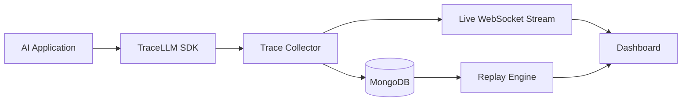
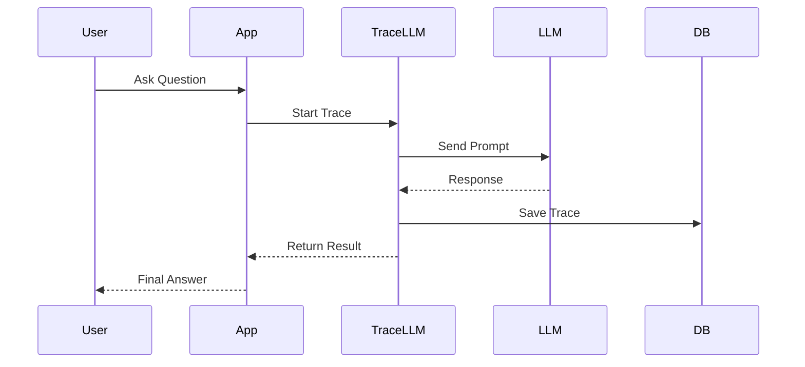
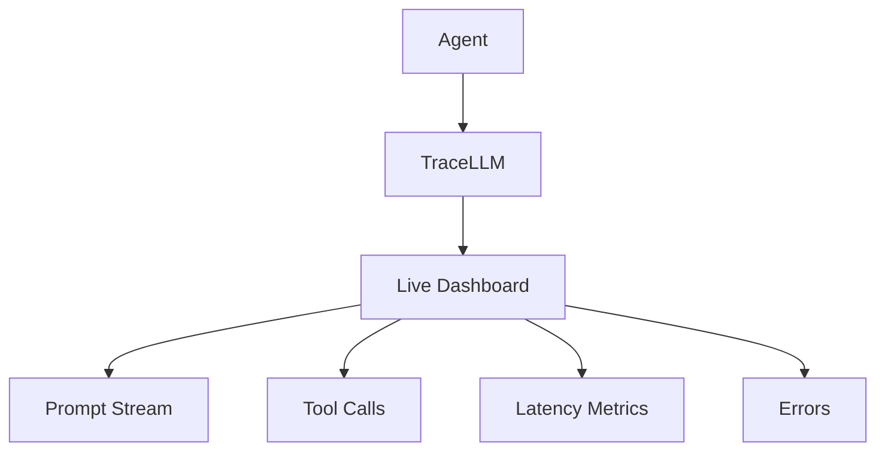

<div align="center">


### Open-Source Observability Platform for AI Applications & Agents

Track prompts, latency, token usage, execution traces, tool calls, retries, hallucinations, and agent workflows in real time.

<p align="center">
  
  
  
  
  
  
</p>

</div>


---

# Demo

> See TraceLLM monitoring AI agents in real time.

<p align="center">

🎥 DEMO VIDEO HERE

<!-- Replace with your demo video -->

https://your-demo-video-link.com

</p>

---

# Screenshots

## Dashboard Overview


---

## Live Agent Monitoring


---

## Execution Replay


---

## Prompt & Token Analytics


---

# Why TraceLLM?

Modern AI applications are difficult to debug.

Traditional logs tell you:

```text
Request received
Response generated
Request completed
```

They do NOT tell you:

- Which prompt was sent
- Which tools were called
- Why the model failed
- Where latency occurred
- Which step hallucinated
- Which retry fixed the issue
- How agent decisions evolved

TraceLLM solves this problem.

---

# What TraceLLM Captures

| Feature | Supported |
|----------|------------|
| Prompt Tracking | ✅ |
| Response Tracking | ✅ |
| Tool Call Inspection | ✅ |
| Agent Workflow Replay | ✅ |
| Latency Analysis | ✅ |
| Token Monitoring | ✅ |
| Error Tracking | ✅ |
| Real-time Streaming | ✅ |
| OpenAI Integration | ✅ |
| LangChain Integration | ✅ |
| WebSocket Monitoring | ✅ |

---

# Architecture



---

# How It Works



---

# Installation

Install directly from PyPI.

```bash
pip install tracellm-cli
```

Verify installation:

```bash
tracellm --help
```

Start TraceLLM:

```bash
tracellm start
```

---

# MongoDB Setup

Create a `.env`

```env
MONGO_URL=your_mongodb_connection_string
DB_NAME=tracellm
```

Run:

```bash
tracellm start
```

Expected output:

```text
✓ MongoDB connected
✓ API ready
✓ WebSocket ready
```

---

# Quick Start

## Basic Trace

```python
from tracellm import trace

@trace
def ask_llm():
    return "Hello World"

ask_llm()
```

---

# OpenAI Example

```python
from openai import OpenAI
from tracellm.integrations.openai import trace_openai

client = OpenAI()

trace_openai(client)

response = client.chat.completions.create(
    model="gpt-4o-mini",
    messages=[
        {
            "role": "user",
            "content": "Explain quantum computing"
        }
    ]
)
```

---

# LangChain Example

```python
from tracellm.integrations.langchain import trace_langchain

trace_langchain()

# existing LangChain code continues normally
```

---

# Replay Executions

One of TraceLLM's most powerful features.

Replay previous executions step-by-step.

```text
Prompt
 ↓
Tool Call
 ↓
Tool Result
 ↓
LLM Response
 ↓
Final Output
```

Perfect for:

- Agent debugging
- Failure analysis
- Performance optimization
- Prompt engineering

---

# Real-Time Monitoring



---

# Trace Lifecycle

```text
START TRACE
    ↓
Capture Prompt
    ↓
Capture Model Response
    ↓
Capture Tool Calls
    ↓
Calculate Latency
    ↓
Store Execution
    ↓
Stream Live Updates
    ↓
END TRACE
```

---

# Performance Metrics

| Metric | Description |
|----------|------------|
| Prompt Count | Total prompts executed |
| Token Usage | Input/output tokens |
| Latency | Response time |
| Error Rate | Failed executions |
| Tool Usage | Tool invocation count |
| Success Rate | Completed traces |

---

# Example Dashboard Insights

```text
Total Traces       : 12,431
Successful Traces  : 12,007
Failed Traces      : 424

Success Rate       : 96.58%

Average Latency    : 1.4 sec

Tool Calls         : 31,204

Tokens Processed   : 8.7M
```

---

# Tracey 🦖

Meet Tracey.

The official TraceLLM dinosaur mascot.

Tracey helps users:

- Setup MongoDB
- Install TraceLLM
- Create first traces
- Troubleshoot issues
- Understand observability concepts

You'll find Tracey throughout the documentation helping guide you.

---

# Roadmap

## v0.3

- [ ] Multi-project support
- [ ] Better dashboards
- [ ] Search traces
- [ ] Export traces

## v0.4

- [ ] Team collaboration
- [ ] Role management
- [ ] Trace comparison

## v0.5

- [ ] OpenTelemetry support
- [ ] Distributed tracing
- [ ] Production deployment tooling

---

# Contributing

Contributions are welcome.

```bash
git clone https://github.com/YOUR_USERNAME/tracellm

cd tracellm

pip install -r requirements.txt

python main.py
```

Open a Pull Request.

---

# Community

- GitHub Discussions
- Issues
- Feature Requests
- Bug Reports

---

# License

MIT License.

---

# Star History

<p align="center">

⭐ If TraceLLM helps you build better AI systems, consider starring the repository.

</p>

---

# Final Goal

TraceLLM aims to become the open-source observability layer for AI applications.

Build agents.

Trace everything.

Debug faster.

Ship confidently.

🦖 Powered by Tracey.
